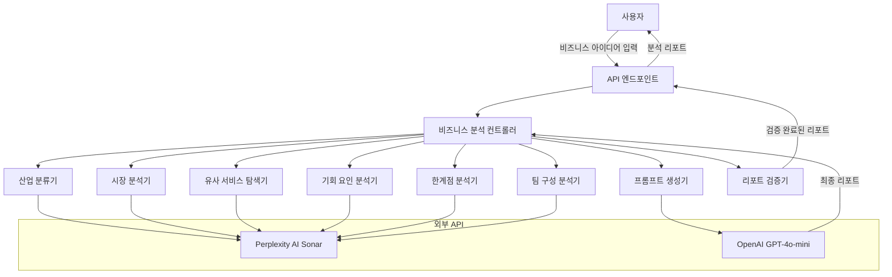
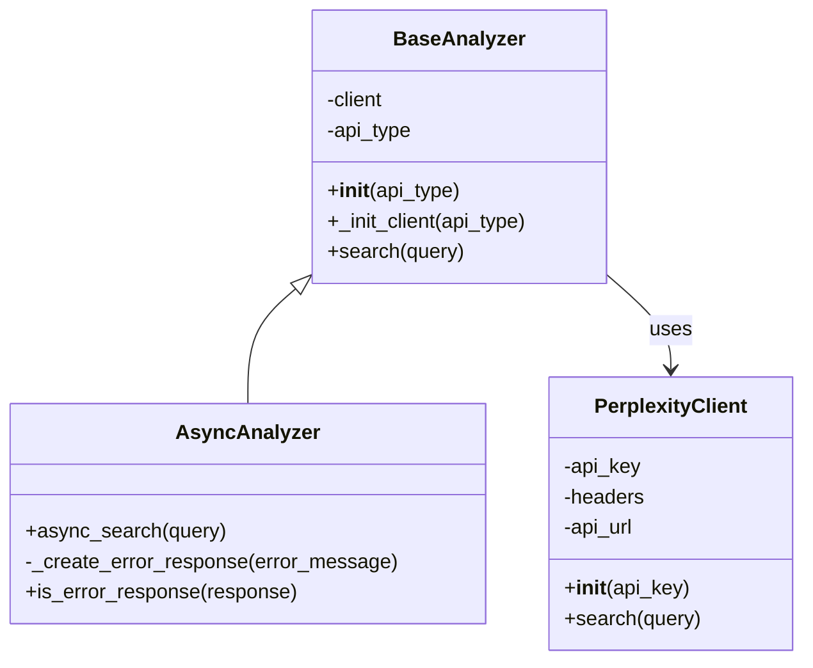
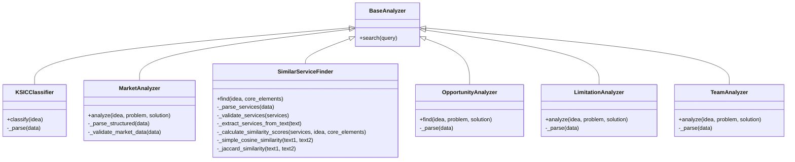
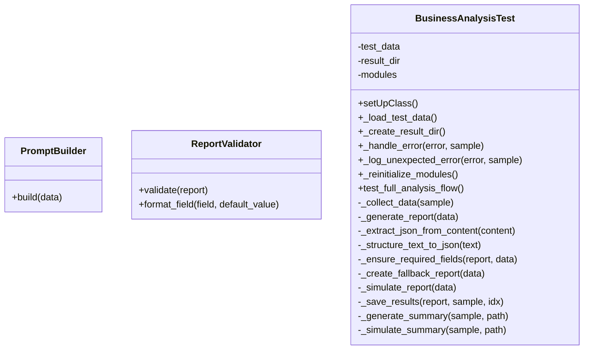
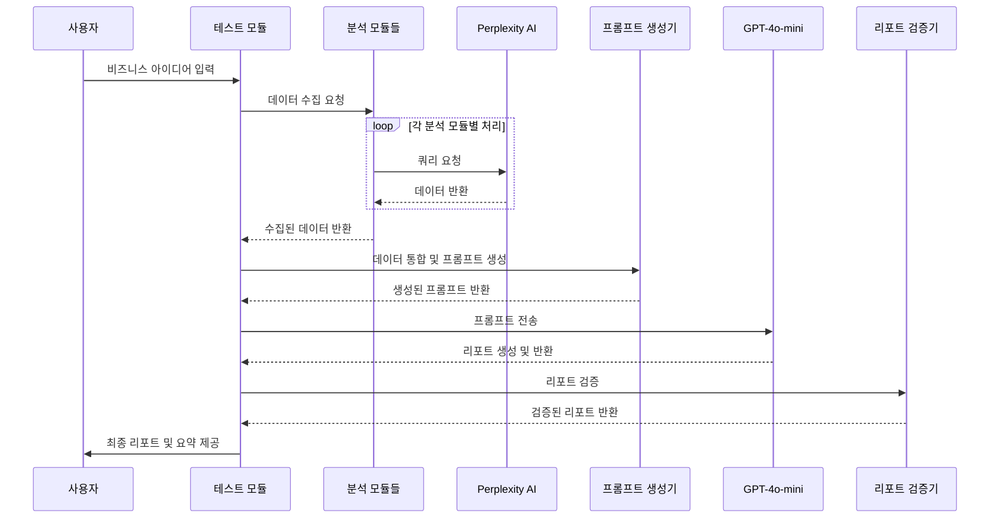

## **프로젝트 개요**

SparkLens는 비즈니스 아이디어를 가진 개인이나 팀에게 데이터 기반의 객관적인 사업화 가능성 평가를 제공합니다. 사용자가 자신의 아이디어(문제점과 해결책)를 입력하면 시스템은 다양한 분석 모듈을 통해 종합적인 사업 평가 리포트를 생성합니다.

## **핵심 기능**

- KSIC(한국표준산업분류) 기반 산업 분류
- 국내 및 글로벌 시장 분석 (규모, 성장률, 평균 매출)
- 유사 서비스 분석 및 유사도 평가
- 타겟 고객층 분석
- 비즈니스 모델 및 수익 구조 제안
- 마케팅 전략 수립
- 기회 요인 및 지원 사업 정보 제공
- 한계점 및 리스크 분석
- 필요 팀원 구성 제안
- 분야별 점수 및 종합 평가

## **기술 스택**

- **데이터 수집**: Perplexity AI의 Sonar API
- **데이터 처리 및 리포트 생성**: OpenAI의 GPT-4o-mini API
- **개발 언어**: Python
- **테스트 프레임워크**: unittest

### 1. 시스템 아키텍쳐 개요

SparkLens는 모듈화된 아키텍처를 채택하여 유지보수성을 높이고 기능별 테스트가 용이하도록 설계되었습니다.

## **컴포넌트 상세 설명**

## **1. 클라이언트 및 API 모듈**

## **BaseAnalyzer (modules/base_client.py)**

모든 분석 모듈의 기본 클래스로, API 클라이언트 초기화 및 검색 기능을 제공합니다.

## **PerplexityClient (pplx_api.py)**

Perplexity AI API와의 통신을 담당하는 클라이언트 클래스입니다.

## **AsyncAnalyzer (async_client.py)**

비동기적으로 API 요청을 수행하는 분석기 클래스입니다. 백오프 재시도 로직을 포함합니다.

## **2. 분석 모듈**

각 분석 모듈은 특정 영역의 데이터를 수집하고 처리하는 역할을 담당합니다.

## **KSICClassifier (modules/industry_classifier.py)**

한국표준산업분류(KSIC) 기준으로 아이디어의 산업 분류를 제공합니다.

## **MarketAnalyzer (modules/market_analyzer.py)**

국내 및 글로벌 시장 규모, 성장률, 평균 매출 등의 시장 분석 데이터를 수집합니다.

## **SimilarServiceFinder (modules/similar_service_finder.py)**

아이디어와 유사한 서비스들을 찾고, 유사도 점수를 계산합니다. 코사인 유사도(70%)와 자카드 유사도(30%)를 결합한 가중 평균 방식을 사용합니다.

## **OpportunityAnalyzer (modules/opportunity_analyzer.py)**

아이디어의 시장 기회 요인과 활용 가능한 지원 사업 정보를 제공합니다.

## **LimitationAnalyzer (modules/limitation_analyzer.py)**

아이디어의 법률적 규제, 특허 관련 이슈, 시장 진입 장벽, 기술적 제약 등의 한계점을 분석합니다.

## **TeamAnalyzer (modules/team_analyzer.py)**

아이디어 실현에 필요한 팀 구성, 역할, 필요 역량, 예상 인건비 등을 분석합니다.

## **3. 프롬프트 및 리포트 처리 모듈**

## **PromptBuilder (modules/prompt_builder.py)**

수집된 데이터를 바탕으로 GPT-4o-mini용 프롬프트를 생성합니다. 최종 리포트 형식과 필요한 항목들을 상세히 정의합니다.

## **ReportValidator (modules/report_validators.py)**

생성된 리포트의 구조와 내용을 검증하고, 누락된 필드가 있는 경우 기본값을 제공합니다.

## **4. 테스트 및 설정 모듈**

## **BusinessAnalysisTest (tests/test_business_analysis.py)**

테스트 시나리오를 실행하고 결과를 검증하는 테스트 클래스입니다. 실제 아이디어 데이터를 로드하여 전체 분석 흐름을 테스트합니다.

## **Settings (config/settings.py)**

환경 변수와 시스템 설정을 관리하는 설정 클래스입니다. API 키, 타임아웃, 재시도 횟수 등을 설정합니다.

## **5. 데이터 흐름도**

